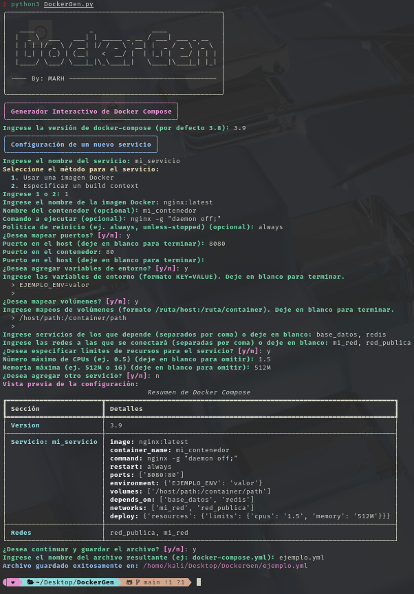

# 🐳 DockerGen

**DockerGen** es una herramienta interactiva de línea de comandos para generar archivos `docker-compose.yml` de manera guiada y personalizada.  
Utiliza una interfaz enriquecida con **rich** y se encarga de instalar automáticamente las dependencias necesarias (*rich* y *PyYAML*).



## Características

- **Generación Interactiva:** Configura múltiples servicios de Docker con opciones avanzadas (build context, mapeo de puertos, variables de entorno, volúmenes, redes, dependencias y límites de recursos).
- **Vista Previa:** Muestra un resumen interactivo de la configuración antes de guardar.
- **Manejo de Archivos:** Verifica si el archivo de salida ya existe y solicita confirmación para sobrescribirlo.
- **Instalación Automática de Dependencias:** No es necesario instalar manualmente *rich* o *PyYAML*; DockerGen se encarga de ello.

# ⚠️ Requisitos

- **Python 3.7+**  
  Verifica la versión ejecutando:
```bash
  python3 --version
```
Docker y Docker Compose
Para utilizar el archivo generado, asegúrate de tener Docker y Docker Compose instalados.

# 🛠️ Instalación
Clona el repositorio o descarga el código fuente:

```bash
git clone https://github.com/Mayky23/DockerGen.git
cd DockerGen
pip3 install rich (Tener en cuenta si presentar error)
```

(Opcional) Crea un entorno virtual:
```bash
python3 -m venv venv
source venv/bin/activate  # En Windows: venv\Scripts\activate
```

# 🖥️​ Uso
Para iniciar DockerGen, ejecuta:
```bash
python3 DockerGen.py
```
# Uso del Archivo Generado
Una vez generado el archivo docker-compose.yml, puedes usarlo con Docker Compose:

## Para iniciar los servicios:
```bash
docker-compose -f docker-compose.yml up -d
```
## Para detener y eliminar los contenedores:
```bash
docker-compose -f docker-compose.yml down
```
